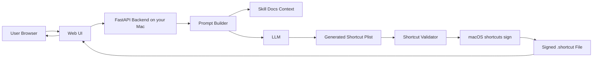
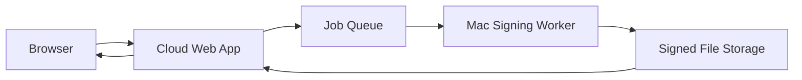

# AI Shortcuts Generator Website Architecture

## Goal

Build a simple website that lets other people describe the Shortcut they want in natural language, then receive a signed `.shortcut` file they can import into Apple's Shortcuts app.

The first demo can run almost entirely on your own Mac:

- Users open a Vite + React web page.
- Users describe the Shortcut they want.
- Your Mac runs a FastAPI backend.
- FastAPI uses this skill's documentation as generation knowledge.
- FastAPI produces a `.shortcut` plist file.
- FastAPI calls the macOS `shortcuts` CLI on your Mac to sign the file.
- Users download the signed `.shortcut` file.

This is a good MVP because the hardest platform-specific step, signing with `shortcuts sign`, already works best on macOS.

## Chosen Tech Stack

The project should be implemented as a front-end/back-end separated app.

```text
Frontend: Vite + React + TypeScript
Backend: FastAPI + Python
AI: OpenAI / Anthropic / another hosted LLM API
Shortcut format: Apple Shortcuts plist / .shortcut
Signing: macOS shortcuts CLI
Runtime for MVP: your Mac
```

Recommended local ports:

```text
Frontend dev server: http://localhost:5174
Backend API server:  http://localhost:8000
```

## Key Answer

You do not need a heavy agent framework for the first version.

For a simple demo, use a Vite + React frontend plus a FastAPI backend generation pipeline. The pipeline can call an LLM with this skill's reference files as context, validate the generated shortcut, sign it on your Mac, and return the downloadable file.

An agent framework becomes useful later if you want the system to plan multi-step workflows, inspect generated files, repair invalid shortcuts automatically, test imports, call external tools, or iterate until the Shortcut is valid.

## Why A Mac Is Needed

The website itself can be used from any device, but the server that signs the generated Shortcut should run on macOS for the MVP.

The important dependency is:

- `shortcuts sign --mode anyone --input <file> --output <file>`

This command is provided by macOS and produces a signed `.shortcut` file that other people can import.

For the first demo, your own Mac can act as the backend server. Other users do not need Macs just to submit prompts and download the generated file, but they will generally need an Apple device with Shortcuts installed to import and use the result.

## MVP Scope

The first demo should be intentionally narrow.

### Included

- A Vite + React single-page web UI.
- A text box where users describe the Shortcut.
- Optional fields for Shortcut name, icon color, and target device.
- A FastAPI endpoint that accepts the request.
- LLM-based Shortcut plist generation using the skill docs.
- Basic validation of the generated plist structure.
- Signing through the macOS `shortcuts` CLI.
- Download link for the signed `.shortcut` file.
- Basic logging for debugging failed generations.

### Not Included Yet

- User accounts.
- Payment.
- Public gallery.
- Complex collaboration features.
- Automatic App Store app capability detection.
- Full execution testing inside Shortcuts.app.
- Multi-agent repair loops.
- Cloud deployment that does not require a Mac.

## High-Level Architecture



## Request Flow

1. User enters a natural-language request, for example: "Create a Shortcut that asks for a topic, generates three tweet ideas, and copies the result to clipboard."
2. Vite + React sends the request to the FastAPI backend.
3. FastAPI builds a generation prompt using selected files from this repository, especially `SKILL.md`, `PLIST_FORMAT.md`, `ACTIONS.md`, `VARIABLES.md`, and `CONTROL_FLOW.md`.
4. LLM returns a Shortcut plist representation.
5. FastAPI validates that the plist has the required root keys, action array, action identifiers, parameters, UUIDs, and control-flow pairings.
6. FastAPI writes an unsigned `.shortcut` file to a temporary workspace.
7. FastAPI runs the macOS `shortcuts sign` command.
8. FastAPI returns a signed `.shortcut` file or a clear error message.
9. User downloads and imports the Shortcut into Shortcuts.app.

## Repository Layout

Recommended structure:

```text
generate-shortcuts-skill/
├── frontend/
│   ├── package.json
│   ├── index.html
│   ├── vite.config.ts
│   └── src/
│       ├── App.tsx
│       ├── api/
│       ├── components/
│       └── styles/
├── backend/
│   ├── pyproject.toml
│   ├── app/
│   │   ├── main.py
│   │   ├── api/
│   │   ├── models/
│   │   ├── services/
│   │   │   ├── prompt_builder.py
│   │   │   ├── shortcut_generator.py
│   │   │   ├── validator.py
│   │   │   ├── signer.py
│   │   │   └── file_store.py
│   │   └── settings.py
│   └── tmp/
├── SKILL.md
├── ACTIONS.md
├── APPINTENTS.md
├── CONTROL_FLOW.md
├── EXAMPLES.md
├── FILTERS.md
├── PARAMETER_TYPES.md
├── PLIST_FORMAT.md
├── VARIABLES.md
├── ARCHITECTURE.md
└── ARCHITECTURE_DIAGRAM.md
```

The existing Markdown skill files can stay at the repository root for now. The FastAPI backend should read them directly as reference material.

## Suggested MVP Modules

### 1. Vite + React Frontend

Responsibility:

- Collect user intent.
- Show generation status.
- Display errors in plain language.
- Provide the final download link.

Recommended first UI:

- Prompt text area.
- Shortcut name field.
- "Generate Shortcut" button.
- Status timeline: generating, validating, signing, ready.
- Download button.

### 2. FastAPI Backend

Responsibility:

- Receive generation requests.
- Rate-limit or queue requests.
- Call the generation pipeline.
- Return the signed file.
- Store temporary artifacts safely.

For a local demo, this can run on your Mac with a local web server. You can expose it to others later with a tunnel such as Cloudflare Tunnel, Tailscale Funnel, or ngrok.

Suggested endpoints:

```text
POST /api/shortcuts/generate
GET  /api/shortcuts/download/{job_id}
GET  /api/health
```

Initial request shape:

```json
{
  "prompt": "Create a Shortcut that asks for my name and shows a greeting.",
  "name": "Greeting Shortcut",
  "target": "macOS"
}
```

Initial response shape:

```json
{
  "job_id": "request-id",
  "status": "ready",
  "download_url": "/api/shortcuts/download/request-id"
}
```

### 3. FastAPI CORS Boundary

Responsibility:

- Allow the Vite dev server to call the backend during local development.
- Restrict allowed origins before sharing the demo publicly.

Local MVP allowed origin:

```text
http://localhost:5174
```

### 4. Prompt Builder

Responsibility:

- Convert user intent into a precise LLM instruction.
- Select the minimum needed reference docs from this skill.
- Ask for structured output that can be validated.
- Include rules such as UUID format, plist root structure, variable references, and signing requirements.

This module is the bridge between the website and the current skill.

### 5. Shortcut Generator

Responsibility:

- Call the LLM.
- Produce the unsigned Shortcut plist.
- Keep generation deterministic enough for validation.
- Preserve enough metadata to debug bad outputs.

The MVP can be a single LLM call. Later versions can use a planner, generator, validator, and repair loop.

### 6. Validator

Responsibility:

- Check that the generated file is a valid plist.
- Check required Shortcut root keys.
- Check that `WFWorkflowActions` is an array.
- Check action dictionaries contain `WFWorkflowActionIdentifier` and `WFWorkflowActionParameters`.
- Check UUIDs are uppercase and unique where needed.
- Check variable references point to existing action UUIDs.
- Check control-flow actions are properly opened and closed.

Validation is important because LLM output can look correct while still failing inside Shortcuts.app.

### 7. Signer

Responsibility:

- Run the macOS `shortcuts sign` CLI from FastAPI.
- Produce a signed `.shortcut` file.
- Return signing errors clearly.
- Keep unsigned and signed files isolated per request.

For the demo, signing should happen locally on your Mac.

### 8. File Store

Responsibility:

- Keep temporary request files.
- Store generated signed files briefly.
- Clean up old files automatically.

For the MVP, local temporary folders are enough. Later, this can move to object storage.

## Local Demo Deployment

### Recommended First Demo

Run everything on your Mac:

- Frontend: Vite dev server.
- Backend: FastAPI with Uvicorn.
- LLM: hosted API provider.
- Signing: local `shortcuts` CLI.
- Files: local temp directory.

Access options:

- Private demo on your own machine: `localhost`.
- Demo for nearby testers: local network address.
- Demo for remote testers: secure tunnel to your Mac.

This avoids solving Mac cloud hosting too early.

Local topology:

```text
Browser
  -> http://localhost:5174
  -> Vite dev server
  -> http://localhost:8000/api
  -> FastAPI
  -> LLM API
  -> macOS shortcuts sign
  -> signed .shortcut
```

### Public Demo Caution

If you expose your Mac to the internet, add guardrails first:

- Require a simple access token or password.
- Limit request size.
- Limit concurrent jobs.
- Delete generated files after a short time.
- Avoid letting user input become shell arguments directly.
- Run signing in a restricted temp directory.
- Log enough to debug, but do not store sensitive prompts forever.

## Do You Need An Agent Framework?

### For The First Demo

No. A direct pipeline is simpler and safer:

```text
User prompt -> LLM generation -> validate -> sign -> download
```

This is easier to debug and faster to ship.

### Later

Consider an agent framework when you need:

- Multi-step planning.
- Automatic repair after validation failure.
- Tool calling across many references.
- Searching action docs dynamically.
- Testing generated files.
- Asking follow-up questions only when required.
- Generating complex workflows with branches, loops, menus, and AppIntents.

The first "agent-like" improvement does not need a full framework. It can be a small loop:

```text
Generate -> validate -> if invalid, ask LLM to repair -> validate again -> sign
```

## Recommended Technical Direction

### Phase 1: Local MVP

Goal:

- Prove that a user prompt can become a signed, downloadable Shortcut.

Architecture:

- Vite + React frontend.
- FastAPI backend.
- One LLM call.
- Basic plist validation.
- Local `shortcuts sign`.

Success criteria:

- Generate a "Hello World" Shortcut from the website.
- Generate an "Ask for input then show result" Shortcut.
- Download and import both into Shortcuts.app.

### Phase 2: Better Reliability

Goal:

- Improve success rate for non-trivial Shortcuts.

Add:

- Structured intermediate representation before plist output.
- Stronger validation.
- One repair attempt when validation fails.
- Better error messages.
- A small library of known-good templates.

### Phase 3: Shareable Product

Goal:

- Let real users try it safely.

Add:

- Authentication or invite links.
- Usage limits.
- Job queue.
- Download expiration.
- Prompt history.
- Example gallery.
- Feedback button for failed imports.

### Phase 4: Production Architecture

Goal:

- Move beyond a personal Mac demo.

Options:

- Keep a dedicated Mac mini as the signing worker.
- Use a Mac cloud provider for signing jobs.
- Split web app and signing worker.
- Keep the public API in normal cloud hosting.
- Send signing jobs to the Mac worker through a private queue.

Production shape:



## Suggested File Lifecycle

For each generation request:

1. Create a unique request ID.
2. Create a temp directory for that request.
3. Save the generated unsigned plist or `.shortcut`.
4. Validate it.
5. Sign it into a separate output file.
6. Return the signed file.
7. Delete request files after expiration.

Avoid reusing filenames across requests.

## Security Notes

The most important security boundary is around signing.

Do not let arbitrary user input become a shell command. The backend should control file paths, filenames, and command arguments. User text should only influence the generated Shortcut content, not the command used to sign it.

Also consider that generated Shortcuts can perform actions on a user's device after import. The website should clearly show a summary of what the Shortcut is intended to do before download.

## Open Questions

- Should the first demo be private, invite-only, or public?
- Which LLM provider should be used?
- Should generated Shortcuts be stored after download or deleted quickly?
- Should users see the generated action list before downloading?
- Should the MVP support only safe built-in actions first?
- Should complex AppIntent actions be disabled until validation is stronger?

## Recommended Next Step

Build the smallest possible demo:

1. A local web page accepts one prompt.
2. Backend generates only simple built-in Shortcuts at first.
3. Backend signs using your Mac.
4. User downloads the signed `.shortcut`.
5. You manually test import in Shortcuts.app.

This gives you a real working demo without committing too early to an agent framework or a complex cloud architecture.
