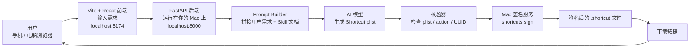
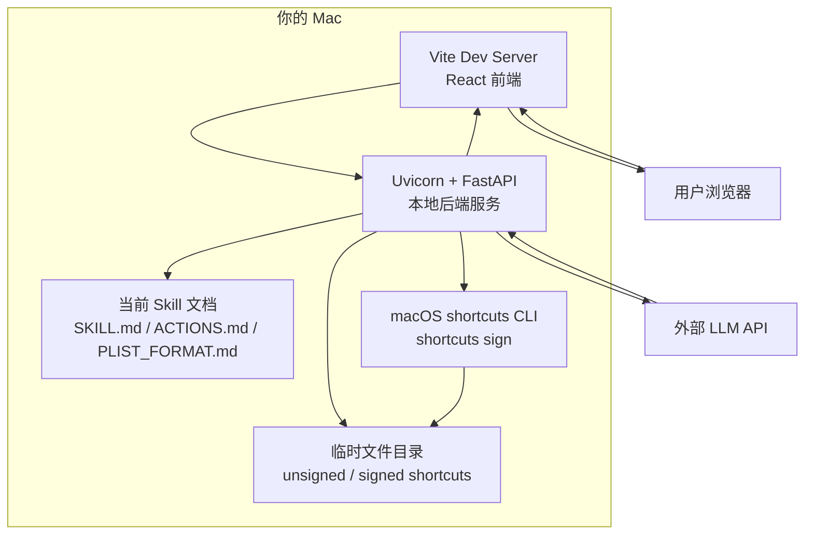
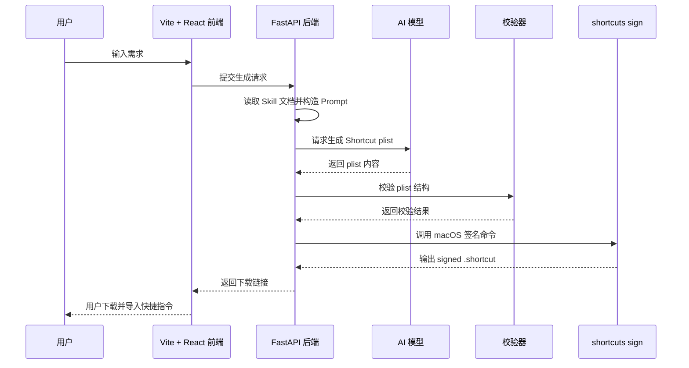
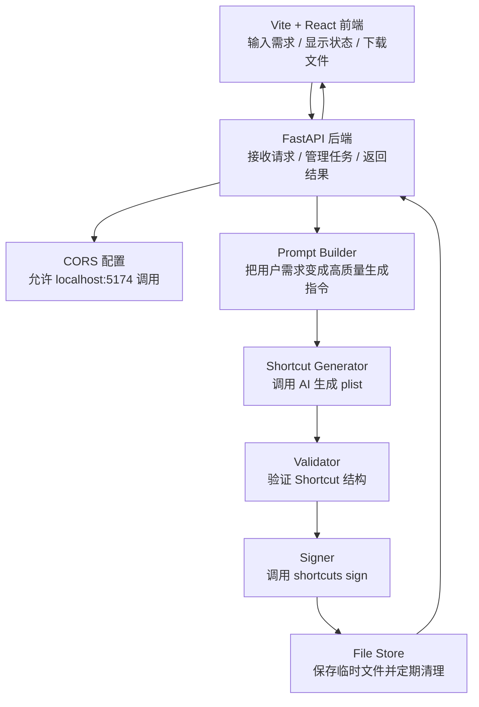
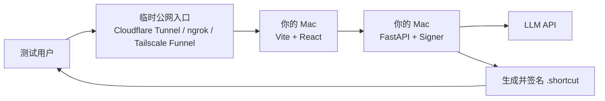
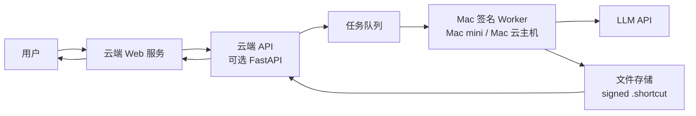
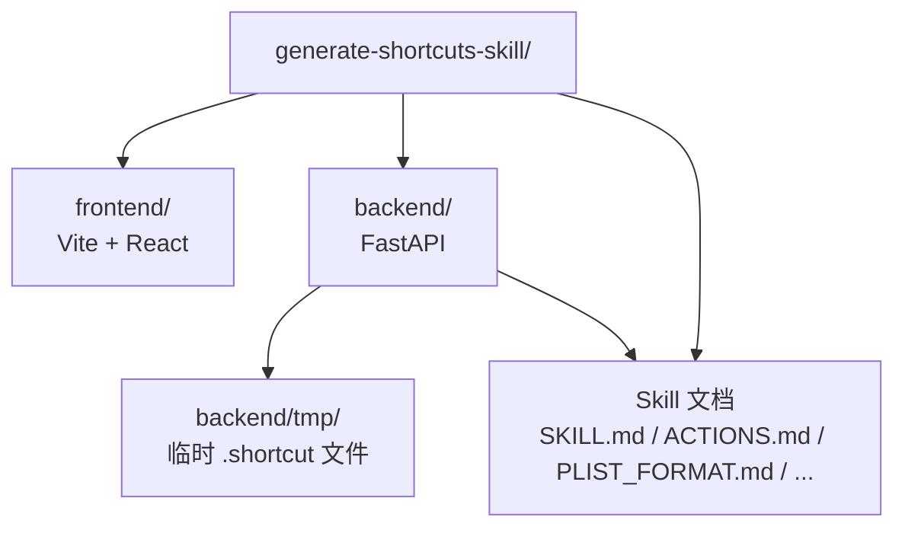

# AI 生成快捷指令网站架构图

## Demo 版总览



## 你的 Mac 在 Demo 里的角色



## 一次生成请求的流程



## MVP 模块拆分



## 推荐的第一版部署方式



## 以后产品化的架构



## 建议目录结构



## 最小 Demo 结论

第一版可以先不做复杂 agent 系统。

最小可行链路是：

```text
Vite React 网页输入 -> FastAPI 后端 -> AI 生成 plist -> 校验 -> shortcuts sign -> 下载 .shortcut
```

等这个链路跑通后，再考虑增加：

- 自动修复失败的 plist。
- 多轮追问。
- 更强的动作检索。
- 模板库。
- 任务队列。
- 专门的 Mac 签名 Worker。
