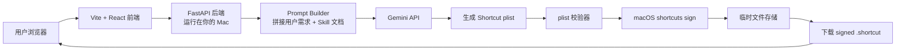
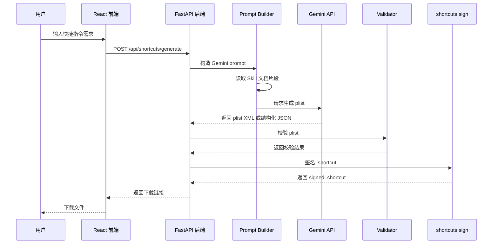
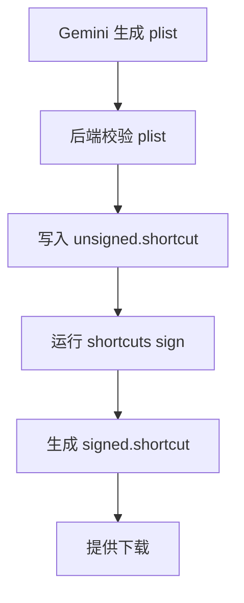
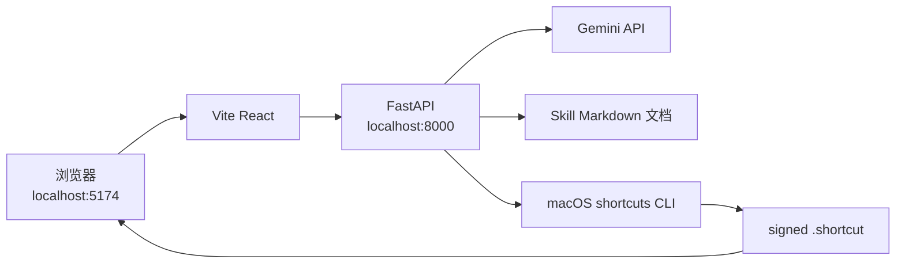

# Gemini 版 AI 快捷指令生成网站架构

## 目标

做一个网页版工具，让用户用自然语言描述想要的 Apple 快捷指令，网站自动生成可导入的 `.shortcut` 文件。

第一版使用：

- 前端：Vite + React
- 后端：FastAPI
- 大语言模型：Gemini API
- 快捷指令格式：Apple Shortcuts plist / `.shortcut`
- 签名环境：你的 Mac 上的 `shortcuts sign`

第一版目标不是做完整平台，而是先跑通：

```text
用户输入需求 -> Gemini 生成 Shortcut plist -> 后端校验 -> Mac 签名 -> 用户下载 .shortcut
```

## 为什么仍然需要 Mac

Gemini 可以生成 plist 内容，但 `.shortcut` 文件要让别人顺利导入，最好经过 macOS 的 `shortcuts sign` 签名。

所以第一版建议：

```text
网页可以被任何设备访问
FastAPI 后端先跑在你的 Mac 上
Gemini API 在云端
签名动作在你的 Mac 本地完成
```

关键命令：

```bash
shortcuts sign --mode anyone --input unsigned.shortcut --output signed.shortcut
```

## 总体架构



## 核心模块

### 1. 前端 Web UI

技术：

```text
Vite + React + TypeScript
```

职责：

- 提供用户输入框。
- 收集快捷指令名称。
- 收集目标平台，例如 macOS / iPhone。
- 提交生成请求到 FastAPI。
- 展示生成状态。
- 展示错误信息。
- 提供 `.shortcut` 下载按钮。

第一版页面可以很简单：

```text
标题
快捷指令名称输入框
需求描述 textarea
生成按钮
生成状态
下载按钮
```

### 2. FastAPI 后端

技术：

```text
FastAPI + Python
```

职责：

- 接收前端请求。
- 读取当前 skill 文档。
- 构造 Gemini prompt。
- 调用 Gemini API。
- 接收 Gemini 返回的 plist。
- 校验 plist。
- 调用 `shortcuts sign` 签名。
- 返回下载链接。

建议接口：

```text
GET  /api/health
POST /api/shortcuts/generate
GET  /api/shortcuts/download/{job_id}
```

生成请求：

```json
{
  "name": "Morning Briefing",
  "prompt": "生成一个快捷指令，询问今天的任务，然后把任务列表显示出来",
  "target": "iOS"
}
```

生成响应：

```json
{
  "job_id": "abc123",
  "status": "ready",
  "download_url": "/api/shortcuts/download/abc123",
  "signed": true
}
```

## Gemini API 在系统里的位置

Gemini 不直接操作文件，也不直接签名。

Gemini 只负责：

```text
理解用户需求
选择合适的 Shortcut actions
生成符合 Apple Shortcuts plist 格式的内容
```

后端负责：

```text
控制 prompt
限制输出格式
校验生成结果
签名文件
返回下载
```

这样做更安全，也更容易调试。

## Gemini 调用流程



## Prompt Builder 设计

Prompt Builder 是这个项目最重要的模块之一。

它需要把用户需求变成 Gemini 能稳定执行的任务。

输入：

```text
用户自然语言需求
快捷指令名称
目标平台
相关 skill 文档片段
输出格式要求
安全规则
```

输出：

```text
发送给 Gemini API 的完整 prompt
```

第一版可以读取这些文档：

```text
SKILL.md
PLIST_FORMAT.md
ACTIONS.md
VARIABLES.md
CONTROL_FLOW.md
PARAMETER_TYPES.md
EXAMPLES.md
```

但是不建议每次把所有文档都塞给 Gemini。更好的第一版策略是：

```text
固定放入 SKILL.md + PLIST_FORMAT.md + VARIABLES.md
根据用户关键词选取 ACTIONS.md / CONTROL_FLOW.md / FILTERS.md 的相关片段
附加 1-2 个相似 EXAMPLES.md 示例
```

## Gemini 输出格式选择

有两种路线。

### 路线 A：让 Gemini 直接输出 plist XML

优点：

- 实现简单。
- 第一版最快。
- 可以直接写入 `.shortcut` 文件。

缺点：

- XML 容易格式错误。
- 后续修复和校验较麻烦。

适合第一版 Demo。

### 路线 B：让 Gemini 输出结构化 JSON，再由后端生成 plist

优点：

- 更稳定。
- 更容易校验。
- 更方便做模板、修复和安全检查。

缺点：

- 后端需要实现 JSON -> plist 转换器。
- 第一版工作量更大。

适合第二阶段。

建议：

```text
第一版：Gemini 直接输出 plist XML
第二版：升级为 Gemini 输出 Shortcut IR JSON，后端转换成 plist
```

## 校验策略

后端必须校验 Gemini 输出，不能直接签名返回。

第一版至少校验：

- 是否是合法 plist。
- 根节点是否包含 `WFWorkflowActions`。
- `WFWorkflowActions` 是否是数组。
- 每个 action 是否包含 `WFWorkflowActionIdentifier`。
- 每个 action 是否包含 `WFWorkflowActionParameters`。
- UUID 是否大写。
- 引用的 `OutputUUID` 是否存在。
- 控制流 action 是否成对出现。

如果校验失败：

```text
返回错误给前端
或者进入一次 Gemini 修复流程
```

第一版可以先返回错误。第二版再加自动修复。

## 签名流程



签名失败时：

- 本地开发可以返回 unsigned fallback，方便调试。
- 对外 Demo 应该提示签名失败，不建议返回未签名文件给普通用户。

## 推荐目录结构

```text
generate-shortcuts-skill/
├── frontend/
│   ├── package.json
│   ├── vite.config.ts
│   └── src/
│       ├── App.tsx
│       ├── api/
│       │   └── shortcuts.ts
│       ├── components/
│       └── styles.css
├── backend/
│   ├── pyproject.toml
│   ├── requirements.txt
│   └── app/
│       ├── main.py
│       ├── api/
│       │   └── shortcuts.py
│       ├── models/
│       │   └── shortcuts.py
│       └── services/
│           ├── gemini_client.py
│           ├── prompt_builder.py
│           ├── shortcut_generator.py
│           ├── validator.py
│           ├── signer.py
│           └── file_store.py
├── SKILL.md
├── ACTIONS.md
├── PLIST_FORMAT.md
├── VARIABLES.md
├── CONTROL_FLOW.md
├── PARAMETER_TYPES.md
└── EXAMPLES.md
```

## 环境变量

后端需要配置：

```bash
GEMINI_API_KEY=your_gemini_api_key
GEMINI_MODEL=gemini-2.5-flash
```

模型建议：

```text
第一版优先用 gemini-2.5-flash
复杂生成可测试 gemini-2.5-pro
```

如果你更在意成本和速度，先用 Flash。

如果你更在意复杂快捷指令生成质量，再测试 Pro。

## 本地开发拓扑



## MVP 实现顺序

### 第 1 步：保留现有前后端骨架

目标：

- 前端页面可访问。
- FastAPI 可接收请求。
- 下载接口可用。
- `shortcuts sign` 可用。

### 第 2 步：接入 Gemini API

目标：

- 新增 `gemini_client.py`。
- 从环境变量读取 `GEMINI_API_KEY`。
- 后端能向 Gemini 发送 prompt。
- Gemini 返回 plist XML。

### 第 3 步：接入 Prompt Builder

目标：

- 读取 skill 文档。
- 拼接生成规则。
- 控制 Gemini 只输出 plist。
- 降低输出跑偏概率。

### 第 4 步：增强校验

目标：

- plist 结构校验。
- action 参数校验。
- UUID 引用校验。
- 控制流校验。

### 第 5 步：前端体验优化

目标：

- 展示生成进度。
- 展示快捷指令摘要。
- 展示签名状态。
- 展示失败原因。

## 第一版不做的事情

为了先跑通，不建议第一版做：

- 用户登录。
- 支付。
- 历史记录。
- 队列系统。
- 多模型切换。
- 手机端快捷指令列表读取。
- 自动运行用户 iPhone 上的快捷指令。
- 复杂 agent 框架。

这些可以等生成和签名链路稳定后再做。

## 风险点

### 1. Gemini 输出不稳定

解决方向：

- 强 prompt。
- plist 校验。
- 失败后让 Gemini 修复一次。
- 后续改成 JSON IR。

### 2. Apple Shortcuts action 参数复杂

解决方向：

- 第一版限制支持常用 actions。
- 建立模板库。
- 对复杂 AppIntents 暂时降级或提示不支持。

### 3. 签名依赖 Mac

解决方向：

- Demo 阶段跑在你的 Mac。
- 产品化后使用 Mac mini 或 Mac 云主机作为 signing worker。

### 4. 用户导入后可能不符合预期

解决方向：

- 下载前展示 action 摘要。
- 提供用户反馈按钮。
- 保存生成日志用于 debug。

## 推荐的第一版产品形态

第一版网页可以叫：

```text
AI Shortcut Builder
```

页面只做一件事：

```text
输入想法，下载快捷指令
```

最小体验：

```text
1. 用户输入：“生成一个快捷指令，询问我的名字，然后显示 Hello + 名字”
2. 点击 Generate
3. 后端调用 Gemini 生成 plist
4. 后端签名
5. 用户下载 signed .shortcut
6. 用户在 iPhone 或 Mac 上导入运行
```

## 最终结论

这个项目使用 Gemini API 的合理架构是：

```text
Vite + React 前端
    ↓
FastAPI 后端
    ↓
Prompt Builder 读取 skill 文档
    ↓
Gemini API 生成 Shortcut plist
    ↓
后端校验 plist
    ↓
Mac 本地 shortcuts sign
    ↓
返回 signed .shortcut 下载
```

第一版不需要 agent 框架，先用稳定的生成管线即可。等生成复杂度上来以后，再考虑加入检索、修复循环、模板库或 agent 化流程。
