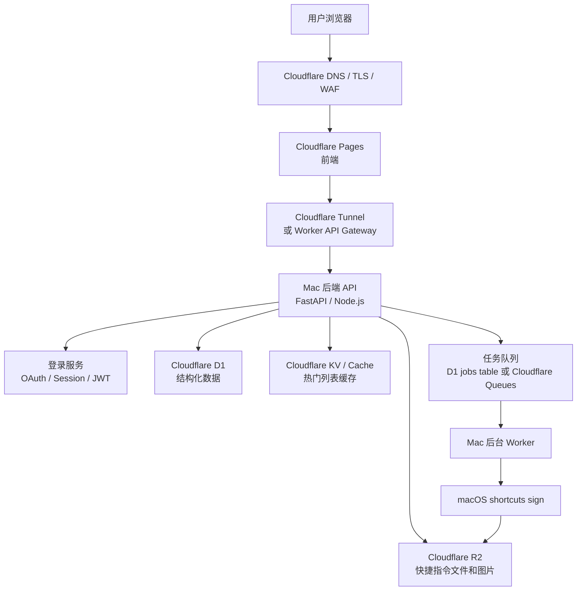

# Mac 后端 + Cloudflare 存储上线方案

## 1. 目标

这个方案的目标是把产品尽快上线，同时保留后续拆分和扩展的空间。

核心判断：

```text
业务后端先部署在 Mac 上，利用 macOS 原生 shortcuts CLI 完成快捷指令签名。
Cloudflare 负责域名入口、安全防护、前端托管、数据库和文件存储。
```

这样可以同时满足两个要求：

- 生成和签名 `.shortcut` 文件必须依赖 macOS 环境。
- Community、用户、文件、发布状态等数据需要放在稳定的云端。

## 2. 总体架构



第一版可以更简单：

```text
Cloudflare Pages 前端
-> Cloudflare Tunnel
-> Mac 后端 API
-> Cloudflare D1 / R2
-> Mac 本地 shortcuts sign
```

## 3. 模块分工

| 模块 | 推荐部署位置 | 职责 |
| --- | --- | --- |
| 前端页面 | Cloudflare Pages | 首页、Editor、Community、登录页、详情页 |
| API 后端 | Mac | 用户请求、Shortcut 生成、发布、签名任务调度 |
| 签名服务 | Mac | 调用 `shortcuts sign --mode anyone` |
| 后台任务 | Mac | 异步生成、校验、签名、上传、重试 |
| 结构化数据库 | Cloudflare D1 | 用户、Shortcut、Community、发布状态、统计 |
| 文件存储 | Cloudflare R2 | `.shortcut` 文件、预览图、导出包、历史版本 |
| 缓存 | Cloudflare KV / Cache | 首页 Community feed、热门榜单、分类缓存 |
| 域名和安全入口 | Cloudflare | DNS、TLS、WAF、Turnstile、Tunnel |
| 防机器人 | Cloudflare Turnstile | 登录、发布、举报、敏感表单防刷 |

## 4. 为什么后端先放 Mac

Apple 快捷指令的正式分发体验最好经过 macOS 的签名命令：

```bash
shortcuts sign --mode anyone --input input.shortcut --output output.shortcut
```

这个命令依赖 macOS、Shortcuts app、Apple/iCloud 相关能力。Linux 服务器适合跑普通 API，但不适合直接完成 Apple 官方签名。

把后端先放在 Mac 上，可以让第一版产品闭环更短：

```text
生成 plist -> 写出 .shortcut -> 校验 -> 签名 -> 上传 R2 -> 返回下载链接
```

## 5. 为什么数据仍然放 Cloudflare

不建议把生产数据只放在 Mac 本地。

原因：

- Mac 可能断电、系统更新、网络中断或 iCloud 掉登录。
- 本地磁盘不适合作为唯一生产存储。
- Community 页面需要稳定的读取性能。
- 后续如果把 API 拆到 Workers 或 Linux，数据不需要迁移。

因此，Mac 应该是业务执行节点，不应该是唯一数据源。

推荐原则：

```text
Mac 可以临时处理文件。
D1 和 R2 才是生产事实来源。
```

## 6. Cloudflare 产品选择

### 6.1 Cloudflare Pages

用于托管前端。

适合页面：

- 首页
- Community
- Shortcut 详情页
- 登录页
- Editor
- 用户中心
- 发布页面

### 6.2 Cloudflare Tunnel

用于把 Mac 上的后端 API 暴露到公网。

好处：

- Mac 不需要公网 IP。
- 不需要在路由器上开端口。
- 使用 Cloudflare 管理域名和 TLS。
- 可以逐步加 WAF、Access、速率限制。

建议域名：

```text
app.example.com      -> Cloudflare Pages
api.example.com      -> Cloudflare Tunnel -> Mac 后端
```

### 6.3 Cloudflare D1

用于存结构化数据。

适合存：

- 用户信息
- 登录账号映射
- Shortcut 元数据
- Shortcut 版本
- 发布状态
- Community 分类和标签
- 点赞、收藏、下载统计
- 举报和审核记录
- 签名任务状态

### 6.4 Cloudflare R2

用于存用户生成内容和文件。

适合存：

- 未签名 `.shortcut`
- 已签名 `.shortcut`
- Shortcut 预览图
- 导出包
- 历史版本快照
- 用户上传的封面图

### 6.5 Cloudflare KV / Cache

用于缓存读多写少的数据。

适合缓存：

- 首页 Community 列表
- 热门 Shortcut 榜单
- 分类页前几页
- 标签列表
- Feature 列表

第一版可以先不用 KV，直接查 D1。等访问量上来后再加缓存。

### 6.6 Cloudflare Turnstile

用于降低机器人和垃圾内容。

建议接入位置：

- 登录注册
- 发布 Shortcut
- 举报
- 评论
- 高频生成请求

## 7. 核心数据模型

第一版不需要做得很复杂，但建议从一开始保留这些概念。

### 7.1 users

用户表。

建议字段：

```text
id
email
display_name
avatar_url
auth_provider
provider_user_id
role
created_at
updated_at
```

### 7.2 shortcuts

Shortcut 主表。

建议字段：

```text
id
author_id
title
slug
summary
description
status
current_version_id
visibility
risk_level
download_count
like_count
favorite_count
created_at
updated_at
published_at
```

状态建议：

```text
draft
private
pending_signing
signed
pending_review
published
unlisted
hidden
deleted
```

### 7.3 shortcut_versions

Shortcut 版本表。

建议字段：

```text
id
shortcut_id
version_number
source_type
unsigned_r2_key
signed_r2_key
preview_r2_key
plist_hash
signed_hash
signing_status
created_at
created_by
```

### 7.4 signing_jobs

签名任务表。

建议字段：

```text
id
shortcut_id
version_id
status
input_r2_key
output_r2_key
attempt_count
last_error
locked_by
locked_at
created_at
updated_at
finished_at
```

状态建议：

```text
queued
running
succeeded
failed
retrying
cancelled
```

### 7.5 community_posts

Community 展示表。

建议字段：

```text
id
shortcut_id
category
featured
rank_score
published_at
hidden_at
```

### 7.6 tags / shortcut_tags

标签和关联表。

用于分类、搜索、推荐。

### 7.7 reports

举报表。

建议字段：

```text
id
shortcut_id
reporter_id
reason
detail
status
created_at
resolved_at
```

## 8. 主要业务流程

### 8.1 用户生成 Shortcut

```text
1. 用户在前端输入需求。
2. 前端调用 Mac API。
3. Mac API 调用 LLM 生成 Shortcut plist。
4. Mac API 校验 plist。
5. Mac API 写出未签名 .shortcut。
6. 上传未签名文件到 R2。
7. 在 D1 创建 shortcut 和 shortcut_version。
8. 返回 Editor 页面数据。
```

### 8.2 用户保存草稿

```text
1. 用户在 Editor 修改 Shortcut。
2. 前端调用保存接口。
3. Mac API 生成新版本。
4. 新版本文件上传 R2。
5. D1 更新 current_version_id。
6. Shortcut 状态保持 draft/private。
```

### 8.3 用户发布到 Community

```text
1. 用户点击 Share to Community。
2. 用户填写标题、简介、分类、标签、权限说明。
3. Mac API 创建 signing_job。
4. Shortcut 状态改为 pending_signing。
5. 后台 Worker 拉取任务。
6. Worker 从 R2 下载未签名文件。
7. Worker 调用 shortcuts sign。
8. Worker 上传已签名文件到 R2。
9. D1 更新版本和发布状态。
10. Community 页面展示该 Shortcut。
```

### 8.4 用户安装 Shortcut

```text
1. 用户打开 Community 详情页。
2. 页面展示用途、作者、权限摘要、风险等级。
3. 用户点击安装。
4. 后端返回已签名 .shortcut 的下载地址。
5. 用户在 Apple 设备上导入 Shortcuts app。
```

### 8.5 签名失败

签名失败时不要让发布流程卡死。

建议处理：

```text
1. signing_job 标记 failed 或 retrying。
2. 记录 last_error。
3. 前端显示“正在准备可安装版本”或“签名失败，稍后重试”。
4. 系统自动重试有限次数。
5. 多次失败后进入人工处理。
```

常见失败原因：

- Mac 没有登录 iCloud。
- Shortcuts app 状态异常。
- macOS 弹出权限确认。
- 输入文件格式错误。
- 网络无法访问 Apple 签名服务。
- Apple 账号触发频率限制或验证。

## 9. API 设计建议

第一版建议接口保持简单。

```text
GET  /api/health
POST /api/auth/login
POST /api/auth/logout
GET  /api/me

POST /api/shortcuts/generate
GET  /api/shortcuts/:id
PATCH /api/shortcuts/:id
POST /api/shortcuts/:id/publish
GET  /api/shortcuts/:id/versions

GET  /api/community
GET  /api/community/:slug
POST /api/community/:id/like
POST /api/community/:id/favorite
POST /api/community/:id/report

GET  /api/downloads/:version_id
GET  /api/jobs/:job_id
```

发布接口建议异步返回：

```json
{
  "shortcut_id": "shortcut_123",
  "version_id": "version_456",
  "status": "pending_signing",
  "job_id": "job_789"
}
```

前端可以轮询：

```text
GET /api/jobs/:job_id
```

## 10. Mac 后端部署建议

### 10.1 运行方式

可选方案：

| 方式 | 适合阶段 | 说明 |
| --- | --- | --- |
| 直接运行进程 | 本地开发 | 最简单 |
| launchd | 早期生产 | macOS 原生守护进程 |
| Docker Compose | 需要隔离时 | 注意容器内不能直接使用所有 macOS GUI/Shortcuts 能力 |
| pm2 / supervisor | Node/Python 服务 | 简单易用 |

如果签名依赖宿主 macOS 的 `shortcuts` 命令，签名 Worker 最好直接跑在宿主机，不要完全关进普通 Linux 容器里。

### 10.2 进程拆分

建议至少拆成两个进程：

```text
api-server
signing-worker
```

好处：

- API 不会被长时间签名任务阻塞。
- 签名 Worker 崩了不会直接拖垮前端 API。
- 后续可以把 signing-worker 单独迁移到另一台 Mac。

### 10.3 目录结构

建议：

```text
backend/
  app/
    api/
    services/
      shortcut_generator.py
      shortcut_validator.py
      signing_service.py
      r2_storage.py
      d1_repository.py
    workers/
      signing_worker.py
    settings.py
  tmp/
    unsigned/
    signed/
    logs/
```

`tmp/` 只存临时文件，可以随时清理。最终文件必须上传 R2。

## 11. 环境变量

建议使用环境变量或系统 secret 管理。

```text
APP_ENV=production
APP_BASE_URL=https://app.example.com
API_BASE_URL=https://api.example.com

DATABASE_URL=
CLOUDFLARE_ACCOUNT_ID=
CLOUDFLARE_D1_DATABASE_ID=
CLOUDFLARE_R2_BUCKET=
CLOUDFLARE_R2_ACCESS_KEY_ID=
CLOUDFLARE_R2_SECRET_ACCESS_KEY=
CLOUDFLARE_R2_ENDPOINT=

AUTH_SECRET=
OAUTH_GOOGLE_CLIENT_ID=
OAUTH_GOOGLE_CLIENT_SECRET=

TURNSTILE_SITE_KEY=
TURNSTILE_SECRET_KEY=

LLM_PROVIDER=
OPENAI_API_KEY=
ANTHROPIC_API_KEY=
GEMINI_API_KEY=

SIGNING_MODE=anyone
SIGNING_WORK_DIR=/path/to/backend/tmp
```

不要把 secret 写入 git。

## 12. 安全策略

### 12.1 登录

建议优先使用第三方登录：

- Google
- GitHub
- Apple

不要第一版自己实现密码登录、邮箱验证、找回密码。

### 12.2 发布安全

发布前需要生成权限摘要。

至少识别：

- 是否访问网络。
- 是否读取剪贴板。
- 是否访问照片。
- 是否访问文件。
- 是否请求位置。
- 是否调用外部 API。
- 是否包含用户需要填入的密钥。
- 是否打开 URL。
- 是否运行脚本。

Community 详情页必须展示这些信息。

### 12.3 R2 文件访问

建议默认私有 bucket。

下载时由后端生成短期有效的下载链接，或者由后端代理下载。

不要让未发布、未审核、未签名版本暴露在公开 URL 上。

### 12.4 Mac 主机安全

Mac 是生产后端，需要按服务器看待：

- 单独创建运行服务的系统用户。
- 关闭不必要的远程访问。
- 使用 Cloudflare Tunnel，不直接暴露端口。
- 定期系统更新，但不要开启会打断服务的自动重启。
- 开启磁盘加密。
- 使用防火墙。
- 保管好 Apple ID 和 Cloudflare token。

## 13. 可观测性

第一版至少要记录：

- API 请求日志。
- 生成耗时。
- LLM 调用错误。
- plist 校验错误。
- 签名任务状态。
- `shortcuts sign` 输出。
- R2 上传失败。
- D1 查询失败。
- Community 下载统计。

建议接入：

- Sentry：前端和后端错误。
- 本地日志文件：Mac 上排查签名问题。
- Cloudflare Analytics：前端访问和域名流量。

签名任务建议有后台页面：

```text
任务 ID
Shortcut ID
状态
重试次数
最后错误
创建时间
完成时间
```

## 14. 备份和恢复

必须备份：

- D1 数据。
- R2 文件。
- 环境变量和部署配置。
- Mac 后端代码。
- launchd / Tunnel 配置。

恢复目标：

```text
换一台 Mac 后，可以重新连接 Cloudflare 数据和文件，并继续签名任务。
```

这也是为什么生产数据不应该只放 Mac 本地。

## 15. MVP 上线步骤

### 阶段 1：本机跑通闭环

```text
1. Mac 后端可以生成 .shortcut。
2. Mac 后端可以调用 shortcuts sign。
3. 前端可以下载已签名文件。
4. 本地 logs 能看到完整过程。
```

### 阶段 2：接入 Cloudflare 存储

```text
1. 创建 D1 数据库。
2. 创建 R2 bucket。
3. 后端把元数据写入 D1。
4. 后端把 .shortcut 上传 R2。
5. 下载接口从 R2 获取文件。
```

### 阶段 3：接入登录和用户空间

```text
1. 用户可以登录。
2. 用户可以看到 My Shortcuts。
3. Shortcut 默认保存为 private draft。
4. 用户可以编辑和生成新版本。
```

### 阶段 4：接入 Community

```text
1. 用户可以提交发布。
2. 系统异步签名。
3. 签名成功后进入 published。
4. 首页展示 Community feed。
5. 详情页提供安装按钮。
```

### 阶段 5：加安全和运维

```text
1. Turnstile 防刷。
2. 权限摘要和风险等级。
3. 举报和下架。
4. 签名任务后台。
5. Sentry 和日志。
6. 备份与恢复流程。
```

## 16. 后续扩展路径

当 Mac 后端压力变大时，可以逐步拆分。

### 16.1 拆 Community API 到 Cloudflare Workers

Community 列表、详情页、点赞、收藏、下载统计都可以迁到 Workers。

Mac 只保留生成和签名。

### 16.2 拆签名为独立 Mac Worker

后端主 API 可以迁到 Linux 或 Workers。

Mac 只执行：

```text
拉取 signing_jobs -> 下载未签名文件 -> shortcuts sign -> 上传 R2 -> 更新状态
```

### 16.3 多台 Mac Worker

如果签名任务变多，可以增加多台 Mac。

需要注意：

- 任务锁。
- 重试机制。
- Apple ID 和 iCloud 状态。
- 每台机器的健康检查。

## 17. 风险清单

| 风险 | 影响 | 缓解方式 |
| --- | --- | --- |
| Mac 掉线 | API 和签名不可用 | Cloudflare Tunnel 监控、健康检查、备用 Mac |
| iCloud 掉登录 | 签名失败 | 签名任务监控、人工告警 |
| Shortcuts CLI 弹窗或卡住 | 队列堆积 | Worker 超时、重启机制、失败重试 |
| R2 上传失败 | 文件不可下载 | 重试、记录错误、保留本地临时文件短时间 |
| D1 写入失败 | 状态不同步 | 事务、重试、任务幂等 |
| 未签名文件泄露 | 用户信任下降 | 私有 R2、短期链接、状态校验 |
| 垃圾内容发布 | Community 质量下降 | Turnstile、审核、举报、限流 |
| 单台 Mac 性能不足 | 请求变慢 | 异步任务、拆 API、增加 Mac Worker |

## 18. 推荐第一版结论

第一版建议采用：

```text
前端：Cloudflare Pages
入口：Cloudflare DNS + TLS + Tunnel
后端：Mac 上的 API server
后台：Mac 上的 signing worker
数据库：Cloudflare D1
文件：Cloudflare R2
缓存：先不用，后续加 KV / Cache
防刷：Cloudflare Turnstile
登录：第三方 OAuth
```

这套方案的重点不是把所有东西都放在 Mac 上，而是：

```text
把必须依赖 macOS 的生成和签名放在 Mac。
把需要稳定保存、公开访问、后续扩展的数据放在 Cloudflare。
```

这样可以最快上线，也不会把未来架构锁死。
